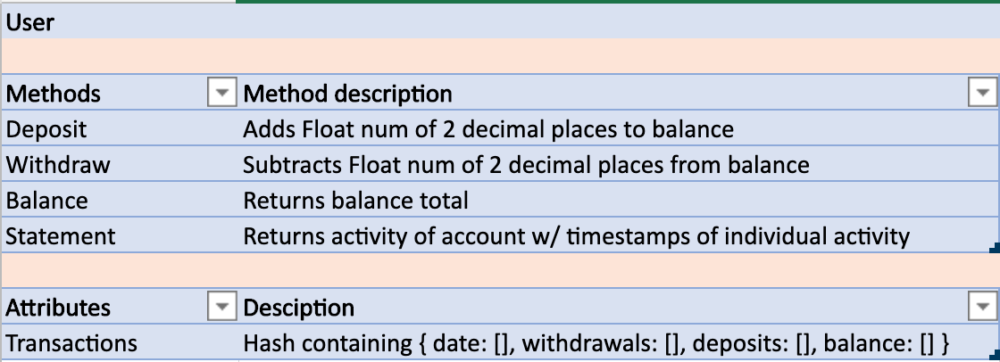
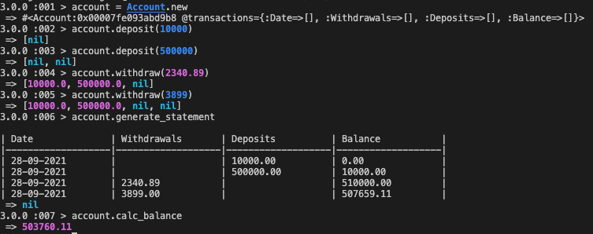

## Bank Tech test

##### The I way approached it

I am tasked with building a simple 'Banking app'.
First I read through the [instructions](https://github.com/makersacademy/course/blob/main/individual_challenges/bank_tech_test.md).
Created user stories from what the specs were.
Following what makers has taught so far I created a model of what I thought the app would look like.
Starting simple and trying to follow TDD to build it up incrementally.

##### The way I structured it

There are four methods.
On deposit 3 items are logged to the transacions hash - nil, ammount to deposit and balance before deposit.
On withdraw 3 items are logged to the transacions hash -  ammount to deposit, nil and balance before deposit.
When calculating balance. It sums the total balance history of all transactions.
gen_statement generates a transaction history from the transaction hash.

### User stories

````
As a customer
So my account has money in it
I would like to deposit money into my bank account

As a bank customer
So I can make a purchase
I would like to be able to withdraw money from my bank account

As a bank customer
So I know when a deposit/withdrawl happened
I would like a timestamp of when the activity occurred

As a customer
So I know how much money is in my bank account
I would like to see a balance of my account

As a customer
So I know how much I've deposited/withdrawn
I would like a statement of the activity related to my account
````

| Date               | Withdrawl          | Deposit            | Balance            |
|--------------------|--------------------|--------------------|--------------------|
| 14/01/2012         |                    | 500.00             | 2500.00            |
| 13/01/2012         | 2000.00            |                    | 3000.00            |
| 10/01/2012         | 1000.00            |                    | 1000.00            |

### Class



### Working application

